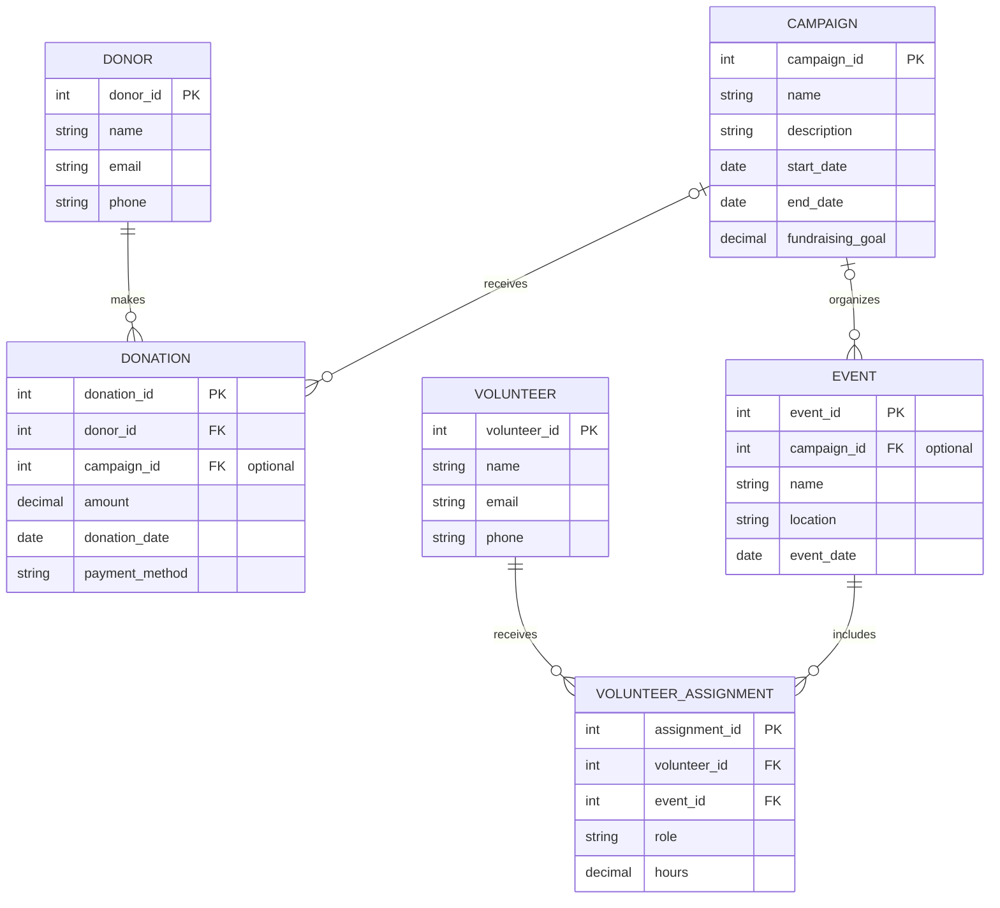

PROJECT TOPIC: NGO Donation & Volunteer Management

## Proposed ER Diagram

```mermaid
erDiagram
	DONOR ||--o{ DONATION : makes
	CAMPAIGN o|--o{ DONATION : receives
	CAMPAIGN o|--o{ EVENT : organizes
	VOLUNTEER ||--o{ VOLUNTEER_ASSIGNMENT : receives
	EVENT ||--o{ VOLUNTEER_ASSIGNMENT : includes

	DONOR {
		int donor_id PK
		string name
		string email
		string phone
	}

	CAMPAIGN {
		int campaign_id PK
		string name
		string description
		date start_date
		date end_date
		decimal fundraising_goal
	}

	DONATION {
		int donation_id PK
		int donor_id FK
		int campaign_id FK "optional"
		decimal amount
		date donation_date
		string payment_method
	}

	VOLUNTEER {
		int volunteer_id PK
		string name
		string email
		string phone
	}

	EVENT {
		int event_id PK
		int campaign_id FK "optional"
		string name
		string location
		date event_date
	}

	VOLUNTEER_ASSIGNMENT {
		int assignment_id PK
		int volunteer_id FK
		int event_id FK
		string role
		decimal hours
	}
```

